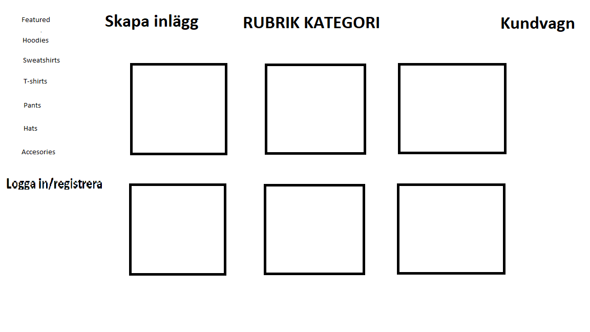
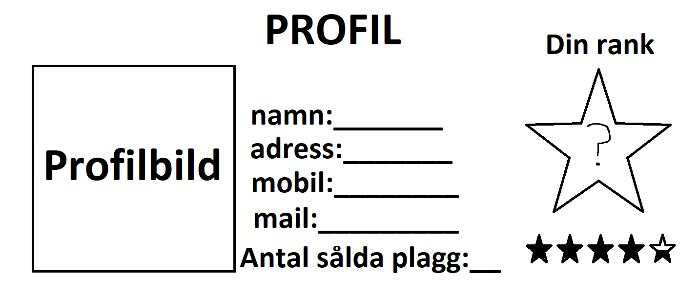
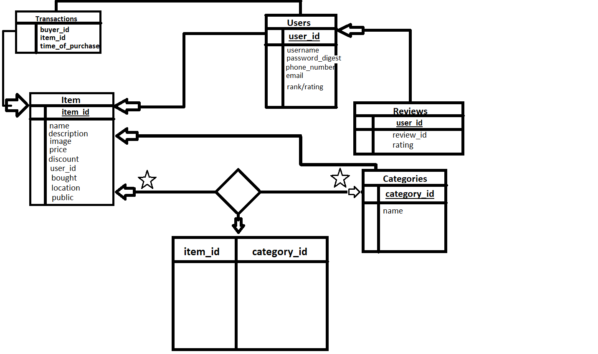

# Projektplan

## 1. Projektbeskrivning (Beskriv vad sidan ska kunna göra).
Jag har bestämt mig för att göra en sida där privatpersoner kan sälja kläder och accessoarer som smycken etc. På sidan ska man kunna lägga upp annonser på varor som man säljer, samt kategorisera varorna så att man senare kan hitta varorna lättare. Man ska även kunna kolla upp en specifik kategori som till exempel "byxor" och hitta plagg där. På sidan kan man kolla på specifika annonser och efter att ha handlat av en person ska man kunna ge säljaren ett betyg från 1-5 stjärnor. Desto högre betyg och fler plagg man sålt kan man gå upp i rank.
## 2. Vyer (visa bildskisser på dina sidor).

## 3. Databas med ER-diagram (Bild på ER-diagram).

## 4. Arkitektur (Beskriv filer och mappar - vad gör/innehåller de?).
Har en misc mapp där jag lägger in bilder samt projektplanen och sådant som inte har med själva koden att göra.

